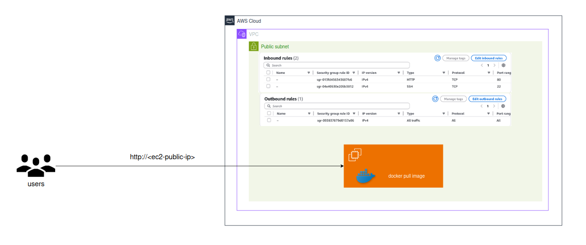
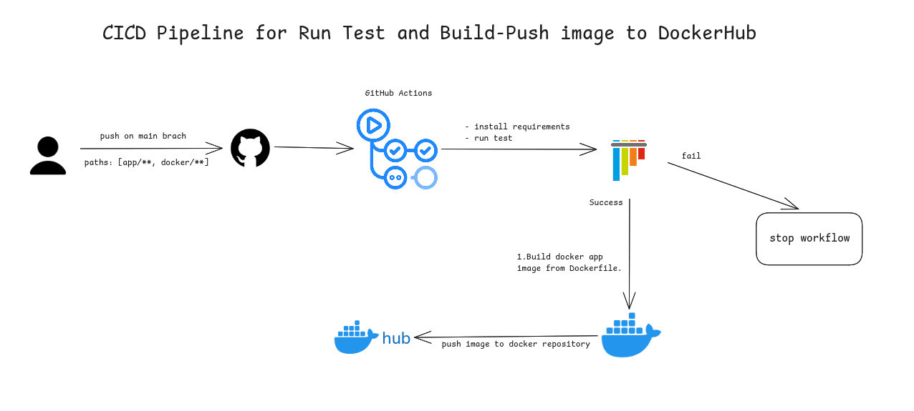
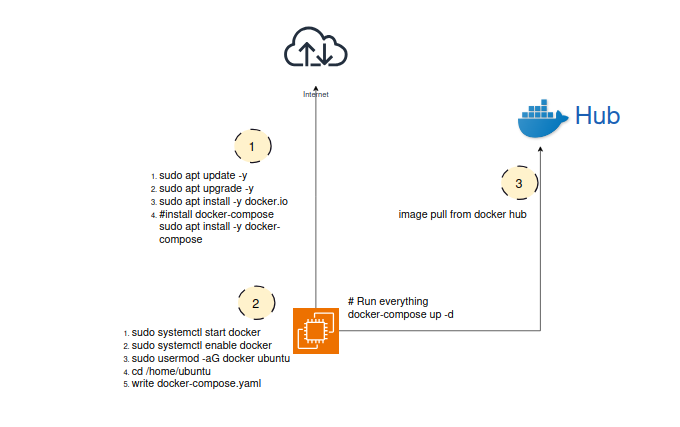
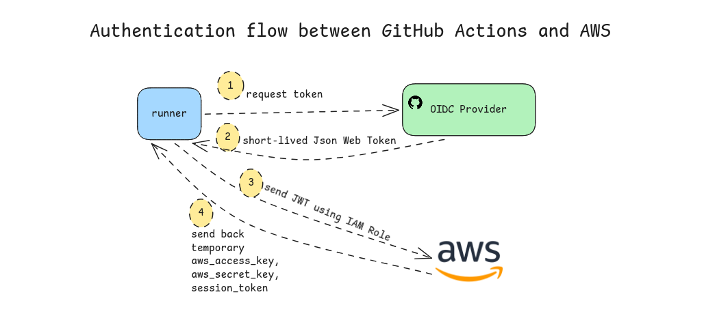
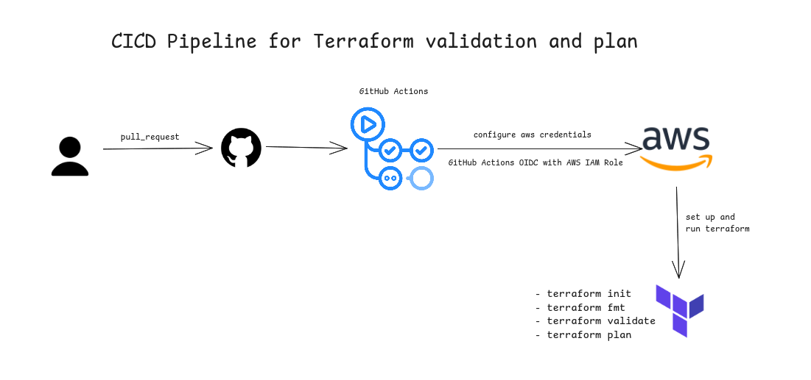
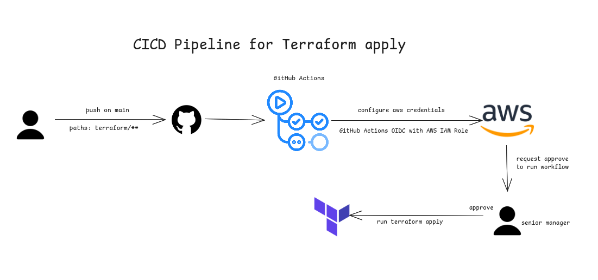

# DevOps Project: Containerized Web App with CI/CD & Terraform

## Overview

This project demonstrates an end-to-end DevOps workflow, focusing on infrastructure automation, containerization, and CI/CD.

The main goal is to automate:

* Application containerization
* Continuous integration and delivery
* Infrastructure provisioning on AWS

---

## Architecture Diagram(Current)

---

* Application and database run as containers using Docker Compose
* EC2 instance is deployed in a public subnet for accessibility
* Infrastructure is provisioned using Terraform

---

## Tech Stack

* **Infrastructure as Code**: Terraform
* **Containerization**: Docker
* **CI/CD**: GitHub Actions
* **Cloud Provider**: Amazon Web Services
* **Database**: PostgreSQL (containerized)

---

## CI/CD Pipeline

The CI/CD pipeline is implemented using GitHub Actions.

### 🔹 Trigger Conditions

* Runs on push to `main` branch
* Triggered when changes occur in:

  * `app/`
  * `docker/`

### 🔹 Pipeline Stages

1. Run tests
2. Build Docker image
3. Push image to Docker Hub

---

## Deployment Strategy

* EC2 instance is initialized using `user_data`
* On startup:

  * Pulls Docker image from Docker Hub
  * Starts services using Docker Compose

> ⚠️ Note: `user_data` runs only once during instance launch. Continuous deployment will be improved in future iterations.

---

## Infrastructure (Terraform)

### Resources Created

* Custom VPC
* Public Subnet
* Internet Gateway
* Route Table & Association
* EC2 Instance
* Security Groups
* SSH Key Pair

### Security Configuration

* Port 80 (HTTP) open to the public
* Port 22 (SSH) restricted to a specific IP address

---

## Authentication & Secrets

* Sensitive data stored using GitHub Secrets
* AWS authentication handled via OIDC (OpenID Connect)

  * Uses IAM Role instead of long-lived access keys

---

## Terraform Workflow

Three separate workflows:

1. **Pull Request**

   * `terraform fmt`
   * `terraform validate`
   * `terraform plan`

2. **Push to main**

   * `terraform apply`

3. **Manual Trigger**

   * `terraform destroy` (via `workflow_dispatch`)

### 🔹 Remote State

* Stored in S3 backend
* Uses `use_lockfile` for state consistency

---

## Current Limitations

* EC2 is in a public subnet (not production best practice)
* No load balancing or auto scaling
* No centralized logging or monitoring
* Database runs as a container (not suitable for scaling)
* Deployment updates require improvement for zero downtime

---

## Future Improvements

### Scalability & High Availability

* Add AWS Application Load Balancer
* Use Auto Scaling Group for EC2 instances
* Move EC2 to private subnets

### Database

* Replace containerized PostgreSQL with Amazon RDS

### Monitoring & Logging

* Integrate Amazon CloudWatch
* Centralize logs and add alerts

### Security

* Add HTTPS using AWS Certificate Manager
* Use reverse proxy such as Nginx

---

## Key Learnings

* Practical experience with CI/CD pipelines
* Infrastructure provisioning using Terraform
* Secure authentication using OIDC
* Containerized application deployment
* Understanding of production architecture limitations and improvements

---

## 📎 Notes

This project focuses on DevOps practices rather than application development.
The application code and tests were sourced externally; the primary focus is on automation, deployment, and infrastructure design.

---
